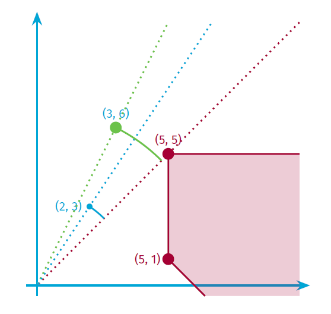
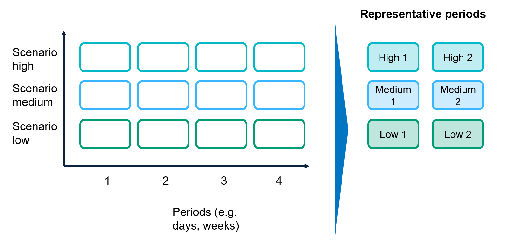

# [Concepts](@id concepts)

The growing integration of renewable energy sources into energy systems requires planning models to account for not only demand variability but also fluctuations in renewable availability during operational periods. Capturing this temporal detail over long planning horizons can be computationally demanding or even intractable. For instance, the following figure shows the availability profile of three technologies and four different countries for the first day of each month of the year.

A common approach to address this challenge is to approximate the problem using a reduced set of selected periods, known as representative periods (RPs). The RPs refers to specific time periods, such as days or weeks, selected to capture the variability and characteristics of the energy system over an extended period, such as a year. The core idea is that many of the periods are similar to each other; such that the solutions are also similar and we do not have to solve all of them and get an approximation from the solutions of the RPs.

To simplify, let's consider a single profile, for a single year.
Let's denote it as $p_i$, where $i = 1,\dots,N$.
The clustering process consists of:

1. Split `N` into (let's assume equal) _periods_ of size `m = period_duration`.
   We can rename $p_i$ as

   $$p_{j,k}, \qquad \text{where} \qquad j = 1,\dots,m, \quad k = 1,\dots,N/m.$$
2. Compute `L = num_rps` representative periods

   $$r_{j,\ell}, \qquad \text{where} \qquad j = 1,\dots,m, \quad \ell = 1,\dots,L.$$
3. During computation of the representative periods, we obtained weight
   $w_{k,\ell}$ between the period $k$ and the representative period $\ell$,
   such that

   $$p_{j,k} = \sum_{\ell = 1}^{L} r_{j,\ell} \ w_{k,\ell}, \qquad \forall j = 1,\dots,m, \quad k = 1,\dots,N/m$$

   The weight $w_{k,\ell}$ maps the representative periods to the base periods (or original periods).

## Clustering Methods

Representative periods are typically chosen using clustering methods. One common approach is `k-means`, where the representative period values, or centroids, are calculated as the average of all base periods within the cluster. Another common method is `k-medoids`, in which the representative period is an actual data point from the cluster.

The `method` parameter in the function [`cluster!`](@ref) allows to select `:k-means` and `:k-medoids` as clustering methods. However, for better approximation, `TulipaClustering` also allows three more different clustering methods to choose representative periods that form the hull of the dataset: `:convex_hull`, `:convex_hull_with_null`, and `:conical_hull`. Although the hull clustering can be combined with different [weight types](@ref weight-fitting), the choice of weight type determines the kind of hull within which the original periods must lie in order to be exactly reconstructible. Specifically:

- `:convex_hull`: For convex weights, the original periods must lie within the convex hull of the representative periods. This is the smallest convex set containing them.
- `:convex_hull_with_null`: For sub-unit conic weights, reconstruction is possible if the original periods lie within the convex hull of the representative periods and the origin (null). Intuitively, this corresponds to finding convex weights that may assign some mass to a null (zero) vector. After discarding the null, the remaining positive weights sum to less than one, hence sub-unit.
- `:conical_hull`: For general conic weights, the reconstruction is valid as long as the original periods lie within the conic hull of the RPs.

We illustrate the differences between these hulls in the following figure, where each successive hull type expands the space in which the original data points can be expressed using the RPs without introducing a projection error. The figure shows the geometric interpretation of different hull types. A set of base period data (dots) is shown, and the shaded region indicates the span of each hull. Even when blended weights are used, this choice of RPs introduces projection errors. The more general the hull type is, the fewer RPs cover the dataset.

For more details on the hull types, check the [scientific references](@ref scientific-refs) section.

## [Weight Fitting](@id weight-fitting)

After the clustering is done, each period is assigned to one representative period. We call this a "Dirac assignment" after the Dirac measure: a measure that is concentrated on one item (i.e., one base period is mapped into exactly one representative period).

`TulipaClustering` supports blended weights for representative periods, meaning that the weigths can be positive fractional numbers.

To produce these, we use projected gradient descent. For more details on the blended weights, check the [scientific references](@ref scientific-refs) section.

The `weight_type` parameter in the function [`cluster!`](@ref) allows to select different ways to select the weights:

- `:conical` weights are positive. The projection is onto a conic hull of the RPs.
- `:conical_bounded` also known as sub-unit conic, weights are positive, add at most into one. The projection is onto a convex hull of the RPs.
and the origin.
- `:convex` weights are positive, add into one. The projection is onto a convex hull of the RPs.
- `:dirac` one unit weight and the rest are zeros. Periods are projected onto a discrete set of representative periods.

The order here is from less restrictive to more restrictive.

The following figure shows the projection errors when approximating base period data using different weight types. Orange areas show the spaces of all points which can be represented without introducing a projection error. Errors decrease from left to right as we move from a discrete Dirac to more general weight types.

## Euclidean Distance vs Dissimilarity

The `distance` parameter in the function [`cluster!`](@ref) defines the metric used to measure how different the datapoints are. The parameter recieves any metric from the package [Distances.jl](https://github.com/JuliaStats/Distances.jl). By default it uses, euclidean distance, meaning that we seek the closest point in the convex hull by calculating the absolute distance. For instance, in the following figure, both points (2,3) and (3,6) is possible to find weights so that its error is smaller when projected to the hull.

Nevertheless, when using the hull clustering, we want to measure dissimilarity so that:

$d(𝑎𝑥, 𝑏𝑦) = d(𝑥, 𝑦) \quad \text{if} \quad 𝑎,𝑏 ∈ ℝ+$.

In other words, we want to measure distance to rays, i.e., angular difference, instead of points. So, why cosine distance? because it meassures the angular distance and it remains the same no matter the magnitude of the data point:

$d_{cos}(𝑎𝑥, 𝑏𝑦) = d_{cos}(𝑥, 𝑦) \quad \text{if} \quad 𝑎, 𝑏 ∈ ℝ+$

## Clustering Per or Cross

The [`ProfilesTableLayout`](@ref) parameter in the function [`cluster!`](@ref) allows users to include `cols_to_groupby` for the clustering process. By default, all profiles will be clustered by the column `:year`, meaning that the representatives will be calculated per year. We recommend this approach because it is expected that renewable profiles will change over time due to advancements in technology. However, if the user prefers to have representative periods cross multiple years, they simply need to provide an empty vector for `cols_to_groupby` in the [`ProfilesTableLayout`](@ref).

In addition, if the profiles to cluster have the column `:scenario` (or similar name), it can be added to the `cols_to_groupby` parameter in order to obtain representative periods per scenario. If the column is in the input profiles, but it is not included in the columns to group by, then by default the representative periods will be calculated cross the scenario. In the following sections, we discuss more on each case.

### Per-Scenario

In this approach, representative periods are chosen separately for each scenario. This involves applying the steps of selection and weight calculation to each scenario individually. As a result, each scenario has its own set of representative periods (RPs) that capture all periods within that scenario.

The following figure illustrates the concept of scenario-specific representative periods. For instance, the high scenario has its own representative periods, labeled RPs High 1 and High 2; the medium scenario has RPs Medium 1 and Medium 2; and the low scenario features RPs Low 1 and Low 2. These representative periods are used to approximate the original periods within each scenario.

One advantage of this approach is that the clustering task is performed on smaller, more homogeneous sets. However, this separation also means that similar patterns across different scenarios may be ignored. As a result, the union of all representatives may include redundant or highly similar periods that increase the model size without adding new information.

### Cross-Scenarios

To better capture the overall structure of the whole scenario space, we propose calculating representative cross-scenarios. Here, representative periods are selected from the combined set of periods across all scenarios, resulting in a single, scenario-independent set of RPs. This approach enables us to identify a smaller set of representative periods that generalize well across different scenarios, thereby reducing redundancy and potentially enhancing model compactness.

The key idea is to perform clustering on the complete joint set of scenarios. The selection process thus considers the joint variability in demand and availability across all scenarios. This enables the model to reuse the same representative periods in multiple scenarios, rather than duplicating similar patterns. In this approach, the weights reflect how many original periods cross all scenarios are best represented by each RP.

The following figure illustrates the concept of representative periods across scenarios. Here, representative periods 1 to 6 are selected from the combined set of periods across all scenarios. These representative periods are then used to approximate the original periods in each scenario.

An advantage of this approach is its ability to minimize redundancy by recognizing similarities between periods in different scenarios. This can lead to a more efficient representation of uncertainty, primarily when common temporal patterns exist across the scenario set. However, it also requires more computational effort during the selection phase.
