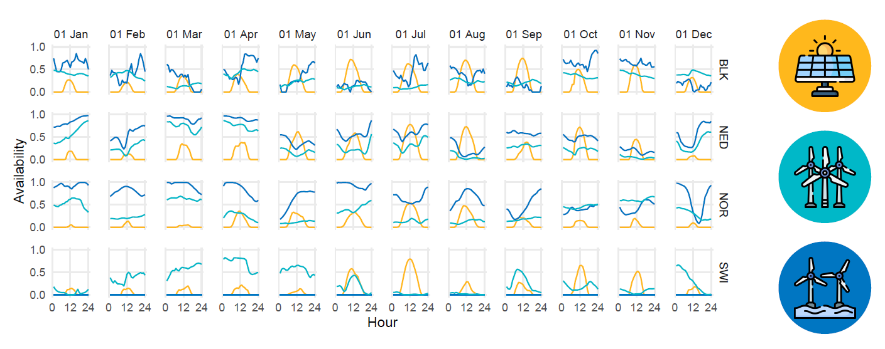
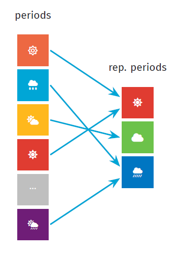
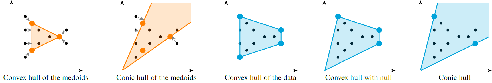
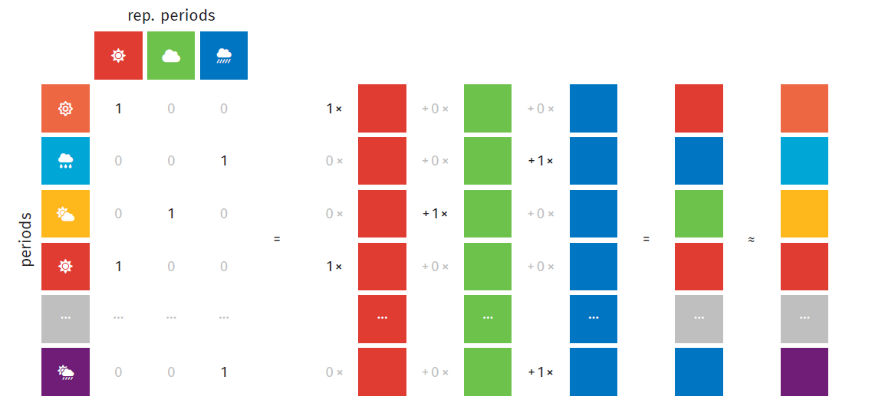
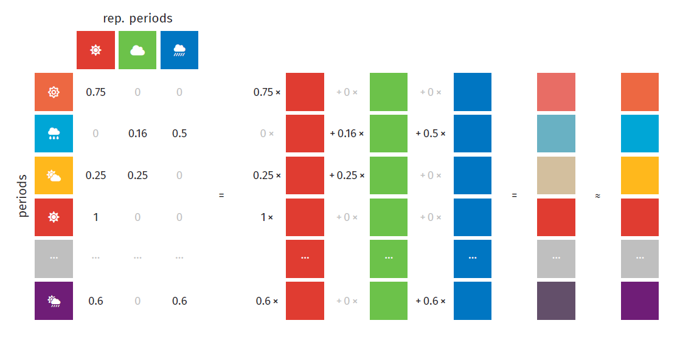
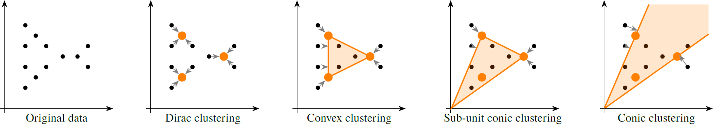
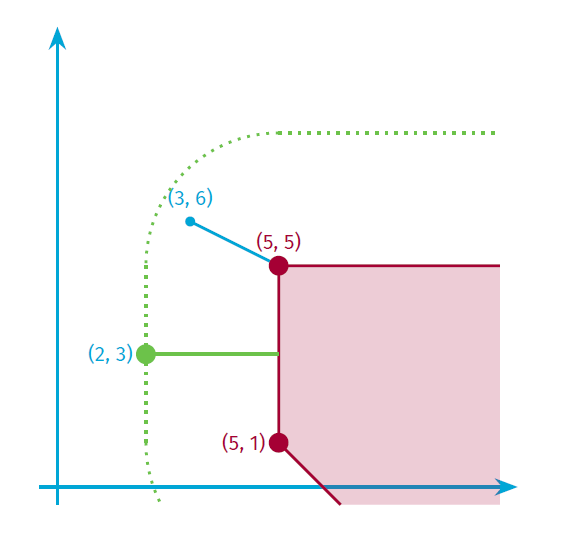
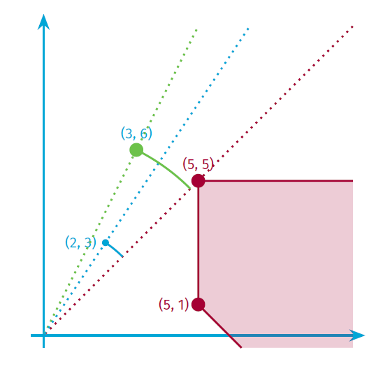
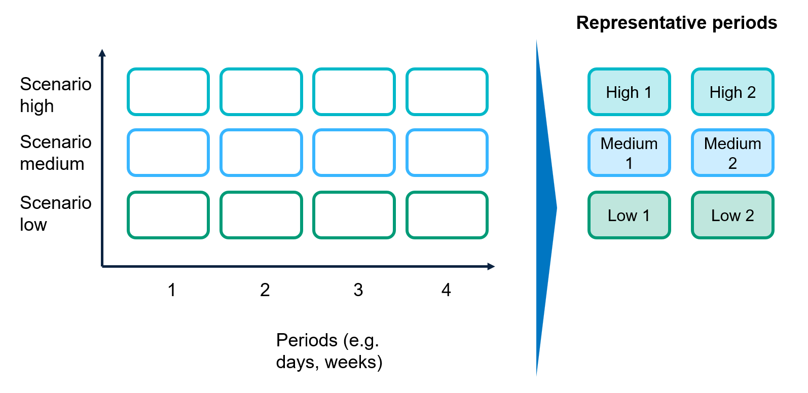
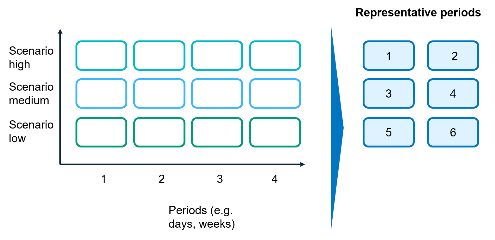

# [Concepts](@id concepts)

The growing integration of renewable energy sources into energy systems requires planning models to account for not only demand variability but also fluctuations in renewable availability during operational periods. Capturing this temporal detail over long planning horizons can be computationally demanding or even intractable. For instance, the following figure shows the availability profile of three technologies and four different countries for the first day of each month of the year.

A common approach to address this challenge is to approximate the problem using a reduced set of selected periods, known as representative periods (RPs). The RPs refers to specific time periods, such as days or weeks, selected to capture the variability and characteristics of the energy system over an extended period, such as a year. The core idea is that many of the periods are similar to each other; such that the solutions are also similar and we do not have to solve all of them and get an approximation from the solutions of the RPs.

To simplify, let's consider a single profile, for a single year.
Let's denote it as $p_i$, where $i = 1,\dots,N$.
The clustering process consists of:

1. Split `N` into (let's assume equal) _periods_ of size `m = period_duration`.
   We can rename $p_i$ as

   $$p_{j,k}, \qquad \text{where} \qquad j = 1,\dots,m, \quad k = 1,\dots,N/m.$$
2. Compute `L = num_rps` representative periods

   $$r_{j,\ell}, \qquad \text{where} \qquad j = 1,\dots,m, \quad \ell = 1,\dots,L.$$
3. During computation of the representative periods, we obtained weight
   $w_{k,\ell}$ between the period $k$ and the representative period $\ell$,
   such that

   $$p_{j,k} = \sum_{\ell = 1}^{L} r_{j,\ell} \ w_{k,\ell}, \qquad \forall j = 1,\dots,m, \quad k = 1,\dots,N/m$$

   The weight $w_{k,\ell}$ maps the representative periods to the base periods (or original periods).

## Clustering Methods

Representative periods are typically chosen using clustering methods. One common approach is `k-means`, where the representative period values, or centroids, are calculated as the average of all base periods within the cluster. Another common method is `k-medoids`, in which the representative period is an actual data point from the cluster.

The `method` parameter in the function [`cluster!`](@ref) allows to select `:k-means` and `:k-medoids` as clustering methods. However, for better approximation, `TulipaClustering` also allows three more different clustering methods to choose representative periods that form the hull of the dataset: `:convex_hull`, `:convex_hull_with_null`, and `:conical_hull`. Although the hull clustering can be combined with different [weight types](@ref weight-fitting), the choice of weight type determines the kind of hull within which the original periods must lie in order to be exactly reconstructible. Specifically:

- `:convex_hull`: For convex weights, the original periods must lie within the convex hull of the representative periods. This is the smallest convex set containing them.
- `:convex_hull_with_null`: For sub-unit conic weights, reconstruction is possible if the original periods lie within the convex hull of the representative periods and the origin (null). Intuitively, this corresponds to finding convex weights that may assign some mass to a null (zero) vector. After discarding the null, the remaining positive weights sum to less than one, hence sub-unit.
- `:conical_hull`: For general conic weights, the reconstruction is valid as long as the original periods lie within the conic hull of the RPs.

We illustrate the differences between these hulls in the following figure, where each successive hull type expands the space in which the original data points can be expressed using the RPs without introducing a projection error. The figure shows the geometric interpretation of different hull types. A set of base period data (dots) is shown, and the shaded region indicates the span of each hull. Even when blended weights are used, this choice of RPs introduces projection errors. The more general the hull type is, the fewer RPs cover the dataset.

For more details on the hull types, check the [scientific references](@ref scientific-refs) section.

## [Weight Fitting](@id weight-fitting)

After the clustering is done, each period is assigned to one representative period. We call this a "Dirac assignment" after the Dirac measure: a measure that is concentrated on one item (i.e., one base period is mapped into exactly one representative period).

`TulipaClustering` supports blended weights for representative periods, meaning that the weigths can be positive fractional numbers.

To produce these, we use projected gradient descent. For more details on the blended weights, check the [scientific references](@ref scientific-refs) section.

The `weight_type` parameter in the function [`cluster!`](@ref) allows to select different ways to select the weights:

- `:conical` weights are positive. The projection is onto a conic hull of the RPs.
- `:conical_bounded` also known as sub-unit conic, weights are positive, add at most into one. The projection is onto a convex hull of the RPs.
and the origin.
- `:convex` weights are positive, add into one. The projection is onto a convex hull of the RPs.
- `:dirac` one unit weight and the rest are zeros. Periods are projected onto a discrete set of representative periods.

The order here is from less restrictive to more restrictive.

The following figure shows the projection errors when approximating base period data using different weight types. Orange areas show the spaces of all points which can be represented without introducing a projection error. Errors decrease from left to right as we move from a discrete Dirac to more general weight types.

## Euclidean Distance vs Dissimilarity

The `distance` parameter in the function [`cluster!`](@ref) defines the metric used to measure how different the datapoints are. The parameter recieves any metric from the package [Distances.jl](https://github.com/JuliaStats/Distances.jl). By default it uses, euclidean distance, meaning that we seek the closest point in the convex hull by calculating the absolute distance. For instance, in the following figure, both points (2,3) and (3,6) is possible to find weights so that its error is smaller when projected to the hull.

### Convex hull projection cache

The hull-selection methods cache each candidate period's projection onto the current
hull by default. When a new representative is added, a cached projection is reused
only when the Euclidean obtuse-angle certificate

$$
(d - q)^\mathsf{T}(c - q) \le 0
$$

holds, where $d$ is the candidate period, $q$ is its cached projection, and $c$ is
the newly added representative. This proves that the cached projection remains valid
for the enlarged hull. The cache is therefore an exact reuse optimization rather than
an approximate distance-ranking heuristic. Pass `cache = false` to recompute every
projection. The certificate is used only with `Euclidean` and `SqEuclidean` distances;
other metrics recompute projections even when caching is enabled.

Nevertheless, when using the hull clustering, we want to measure dissimilarity so that:

$d(𝑎𝑥, 𝑏𝑦) = d(𝑥, 𝑦) \quad \text{if} \quad 𝑎,𝑏 ∈ ℝ+$.

In other words, we want to measure distance to rays, i.e., angular difference, instead of points. So, why cosine distance? because it meassures the angular distance and it remains the same no matter the magnitude of the data point:

$d_{cos}(𝑎𝑥, 𝑏𝑦) = d_{cos}(𝑥, 𝑦) \quad \text{if} \quad 𝑎, 𝑏 ∈ ℝ+$

## [Grouping and Crossing Columns](@id grouping-and-crossing)

[`ProfilesTableLayout`](@ref) assigns two different roles to columns during
[`cluster!`](@ref):

- `cols_to_groupby` partitions the input into independent clustering problems. Each
  unique combination receives its own `num_rps` representative periods.
- `cols_to_crossby` pools periods from its unique values inside each group. The pooled
  values share one set of `num_rps` representative periods.

The two lists must be disjoint. By default, `cols_to_groupby = [:year]` and
`cols_to_crossby = []`, so every year is clustered independently.

A column placed in neither list remains part of the period's feature vector. For example,
if `scenario` is in neither list, period 1 contains the values for period 1 from every
scenario and those aligned values are clustered together. This is not the same as
`cols_to_crossby = [:scenario]`, which treats each scenario-period pair as a separate
candidate in a shared pool.

For a dataset with `Y` years, `S` scenarios, and `num_rps = R`, the choices are:

| Goal | `cols_to_groupby` | `cols_to_crossby` | RPs per year | Scenario in RP profiles | Scenario in mapping |
| --- | --- | --- | --- | --- | --- |
| Separate RPs per scenario | `[:year, :scenario]` | `[]` | `R * S` | Yes | Yes |
| Shared RPs pooled across scenarios | `[:year]` | `[:scenario]` | `R` | No | Yes |
| Shared RPs for aligned multi-scenario periods | `[:year]` | `[]` | `R` | Yes | No |

See [Grouping and crossing in practice](@ref grouping-and-crossing-tutorial) for a
runnable example and the resulting output tables.

### Per-Scenario

Set `cols_to_groupby = [:year, :scenario]` and leave `cols_to_crossby` empty to
choose representative periods separately for each year-scenario combination. Selection
and weight fitting run independently, so the output contains `num_rps` representatives
per combination.

The following figure illustrates the concept of scenario-specific representative periods. For instance, the high scenario has its own representative periods, labeled RPs High 1 and High 2; the medium scenario has RPs Medium 1 and Medium 2; and the low scenario features RPs Low 1 and Low 2. These representative periods are used to approximate the original periods within each scenario.

This approach creates smaller, more homogeneous clustering problems and preserves
scenario-specific behavior. However, similar periods can be selected independently in
several scenarios, increasing the total number of representatives and the downstream
model size.

### Cross-Scenarios

Set `cols_to_groupby = [:year]` and `cols_to_crossby = [:scenario]` to pool all
scenario-period pairs within each year. The selection process chooses one
scenario-independent set of `num_rps` representatives from that pool. Each original
period is still mapped separately, so `rep_periods_mapping` retains the `scenario`
column even though `profiles_rep_periods` and `rep_periods_data` do not.

The following figure illustrates the concept of representative periods across scenarios. Here, representative periods 1 to 6 are selected from the combined set of periods across all scenarios. These representative periods are then used to approximate the original periods in each scenario.

This approach can reduce redundancy and keep the downstream model compact because every
scenario reuses the same representatives. The clustering problem is larger, however, and
a small shared set may represent unusual scenario-specific behavior less accurately than
separate per-scenario sets.
